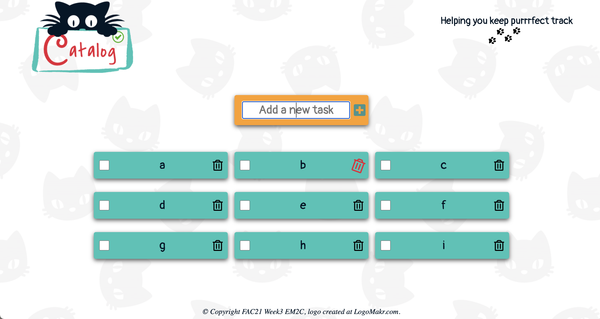

# Week 3 

# Project Catalog EM2C

Evgeny, Maryam, Mariya, Craig

### User: Maryam
Championing the user stories to ensure that your product meets the users’ needs.
### Deployment: Evgeny
Project set up, file architecture, third party tools, keeping secrets secret.
### Quality: Craig
Clear variable names, simple and concise code, adequate test coverage.
### Facilitator: Mariya
Ensuring a smooth process and good communication.

## User stories
- A working to-do list in witch you can:
  - Add, check and delete tasks 
- To use all the features of the app without a mouse
- Tests for (at least) each user story
- A responsive, mobile-first design
- Accessible to as many different users as possible
- Stretch: 
  - Filter out completed to-dos 

We wanted our To-do tracker to look nice so it will be always a plesure to use it, so we put a lot of effort designing and styling it.

We used seamless  images for the background which made it look nice and smother.
Used grid, so on wider screen the tasks added have two column layout.